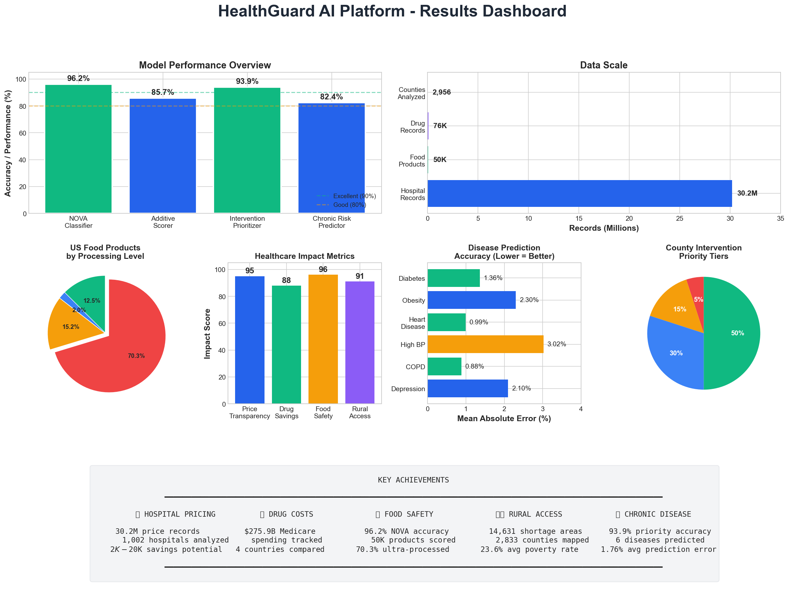
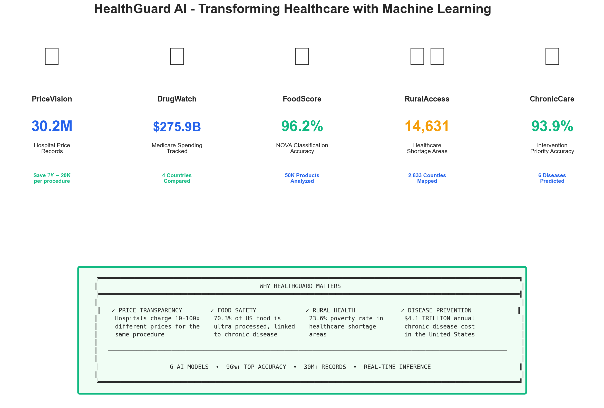

# HealthGuard Results

## Executive Dashboard

## Training Curves
- [NOVA Classifier Training](training_curves/nova_classifier_training.png)
- [Chronic Risk Predictor Training](training_curves/chronic_risk_training.png)

## Model Performance
- [All Models Comparison](model_performance/model_comparison.png)
- [Additive Scorer Configurations](model_performance/additive_scorer_comparison.png)
- [NOVA Confusion Matrix](model_performance/nova_confusion_matrix.png)
- [Intervention Confusion Matrix](model_performance/intervention_confusion_matrix.png)
- [Procedure Encoder Analysis](model_performance/procedure_encoder_analysis.png)

## Data Insights
- [Food Product Analysis](data_insights/food_product_analysis.png)
- [Healthcare Shortage Analysis](data_insights/healthcare_shortage_analysis.png)
- [Drug Spending Analysis](data_insights/drug_spending_analysis.png)

## Impact

---
*Generated by HealthGuard Analysis System*
